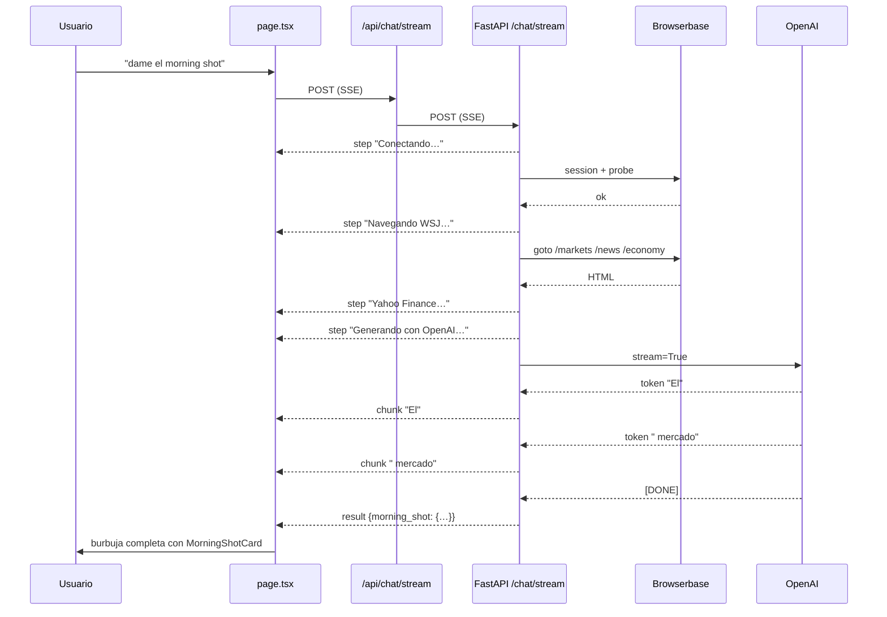

# Plan: SSE Streaming para el chat

## Concepto

En lugar de una respuesta JSON bloqueante (60-120 seg de silencio), el endpoint
`POST /chat/stream` emite eventos `text/event-stream` conforme el backend avanza.
El frontend los consume y actualiza la burbuja en tiempo real.

El endpoint `POST /chat` (sin stream) se mantiene intacto — no se rompe nada.

Estado de implementación:

- `POST /chat/stream` ya emite eventos `step`, `chunk` (solo `chars` acumulados, sin texto), `auth`, `result` y `error`.
- El JSON de OpenAI para `morning_shot` se acumula del lado del backend; la UI muestra progreso por conteo de caracteres en la burbuja de loading.
- La tarjeta final sigue renderizando `MorningShotCard`.
- La UI muestra los pasos reales del stream en la burbuja de loading y conserva `/chat` como fallback para el resumen de noticias.

---

## Tipos de eventos SSE

```
event: step     data: {"text": "Navegando WSJ /markets…"}
event: auth     data: {"site": "wsj", "session_id": "…", "live_view_url": "…"}
event: chunk    data: {"text": "El mercado reaccionó…"}      ← tokens OpenAI
event: result   data: {"tool": "morning_shot", "result": {…}}
event: error    data: {"text": "browserbase_playwright_failed"}
```

---

## Cambios en el backend

### `agent/runtime/app.py`

#### 1. `_openai_stream(compact)` — async generator

Reemplaza `_openai_wsj_summary_sync` para el endpoint de stream.
Usa `AsyncOpenAI` con `stream=True`.

```python
from openai import AsyncOpenAI

async def _openai_stream(compact: dict) -> AsyncGenerator[str, None]:
    client = AsyncOpenAI(api_key=os.getenv("OPENAI_API_KEY"))
    stream = await client.chat.completions.create(
        model=os.getenv("OPENAI_MODEL", "gpt-4o-mini"),
        messages=[{"role": "system", "content": SYSTEM_PROMPT},
                  {"role": "user",   "content": _build_user_prompt(compact)}],
        stream=True,
        temperature=0.25,
        max_tokens=2200,
    )
    async for chunk in stream:
        delta = chunk.choices[0].delta.content
        if delta:
            yield delta
```

#### 2. `_stream_morning_shot(body)` — async generator principal

Emite eventos SSE conforme avanza cada fase del morning shot.

```python
async def _stream_morning_shot(body: ChatRequest) -> AsyncGenerator[str, None]:
    def emit(event: str, data: dict) -> str:
        return f"event: {event}\ndata: {json.dumps(data, ensure_ascii=False)}\n\n"

    yield emit("step", {"text": "Conectando a Browserbase…"})

    bb_result = await fetch_wsj_pages_via_browserbase(
        client_key="browser-stack",
        requested_sections=["market_snapshot", "top_headlines", "economy_policy", "wsj_finance"],
        browserbase_session_id=(body.browserbase_session_id or "").strip() or None,
        base_url=os.getenv("WSJ_BASE_URL", "https://www.wsj.com"),
        paths=PATH_BY_SECTION,
    )

    if bb_result.get("state") == REQUIRES_AUTH_STATE:
        yield emit("auth", {
            "site": body.site or "wsj",
            "session_id": bb_result.get("browserbase_session_id", ""),
            "live_view_url": bb_result.get("interactive_live_view_url", ""),
            "message": bb_result.get("message", ""),
        })
        return   # stream termina; pill retoma con resume_auth=True

    yield emit("step", {"text": "Extrayendo HTML y quotes…"})
    pages = bb_result.get("pages") or {}
    # ... parsing (market_snapshot, headlines, etc.) ...

    yield emit("step", {"text": "Consultando Yahoo Finance…"})
    # ... equity selection + _quote_one ...

    if not os.getenv("OPENAI_API_KEY", "").strip():
        yield emit("result", {"tool": "morning_shot", "result": facts_pack})
        return

    yield emit("step", {"text": "Generando resumen con OpenAI…"})
    collected = ""
    async for token in _openai_stream(compact):
        collected += token
        yield emit("chunk", {"text": token})

    # Parsear JSON acumulado y emitir resultado final
    try:
        summary = _normalize_structured_summary(json.loads(collected))
    except Exception:
        summary = None
    facts_pack["structured_summary"] = summary
    yield emit("result", {"tool": "morning_shot", "result": facts_pack})
```

#### 3. Nuevo endpoint `POST /chat/stream`

```python
from fastapi.responses import StreamingResponse

@app.post("/chat/stream")
async def chat_stream(body: ChatRequest):
    if body.resume_auth or _dispatch_intent(body.message)[0] == "morning_shot":
        return StreamingResponse(
            _stream_morning_shot(body),
            media_type="text/event-stream",
            headers={
                "Cache-Control": "no-cache",
                "X-Accel-Buffering": "no",
                "Connection": "keep-alive",
            },
        )
    # Para news_summary, quote y none: un único evento result
    async def _single_event():
        tool, params = _dispatch_intent(body.message)
        result = await _dispatch_non_streaming(tool, params, body)
        yield f"event: result\ndata: {json.dumps(result, ensure_ascii=False)}\n\n"

    return StreamingResponse(_single_event(), media_type="text/event-stream")
```

---

## Cambios en el proxy Next.js

### `ui/src/app/api/chat/stream/route.ts` (nuevo archivo)

Proxy transparente — pasa el `ReadableStream` sin bufferizar.

```ts
export const maxDuration = 300;

export async function POST(request: Request) {
  const body = await request.json();
  const base = process.env.AGENT_BASE_URL ?? "http://localhost:8012";

  const upstream = await fetch(`${base}/chat/stream`, {
    method: "POST",
    headers: { "Content-Type": "application/json" },
    body: JSON.stringify(body),
  });

  return new Response(upstream.body, {
    headers: {
      "Content-Type": "text/event-stream",
      "Cache-Control": "no-cache",
      "X-Accel-Buffering": "no",
    },
  });
}
```

---

## Cambios en el frontend

### Nuevo tipo de mensaje `building`

```ts
type ChatMessage =
  | ...
  | { id: string; role: "agent"; kind: "building"; text: string }  // ← nuevo
```

La burbuja `BuildingBubble` muestra el texto acumulado + cursor parpadeante:

```tsx
function BuildingBubble({ text }: { text: string }) {
  return (
    <div className="bubble-agent">
      <p className="bubble-text">
        {text}
        <span className="typing-cursor">▌</span>
      </p>
    </div>
  );
}
```

CSS del cursor:
```css
.typing-cursor {
  display: inline-block;
  animation: blink 0.9s step-end infinite;
  color: #4a7fc1;
  margin-left: 1px;
}
@keyframes blink {
  0%, 100% { opacity: 1; }
  50% { opacity: 0; }
}
```

### Hook `useChatStream` (o función interna `callChatStream`)

Reemplaza `callChat` cuando el tool es `morning_shot`.

```ts
const callChatStream = async (payload: Record<string, unknown>, loadingId: string) => {
  const res = await fetch("/api/chat/stream", {
    method: "POST",
    headers: { "Content-Type": "application/json" },
    body: JSON.stringify(payload),
  });

  if (!res.body) throw new Error("No stream body");

  const reader  = res.body.getReader();
  const decoder = new TextDecoder();
  let buffer    = "";
  let buildingId: string | null = null;

  while (true) {
    const { value, done } = await reader.read();
    if (done) break;
    buffer += decoder.decode(value, { stream: true });

    const blocks = buffer.split("\n\n");
    buffer = blocks.pop() ?? "";   // guardar bloque incompleto

    for (const block of blocks) {
      if (!block.trim()) continue;
      const eventLine = block.match(/^event:\s*(\w+)/m)?.[1];
      const dataLine  = block.match(/^data:\s*(.+)/m)?.[1];
      if (!eventLine || !dataLine) continue;
      const data = JSON.parse(dataLine) as Record<string, unknown>;

      if (eventLine === "step") {
        // Actualizar texto del loading bubble con el paso REAL
        setMessages(prev => prev.map(m =>
          m.id === loadingId ? { ...m, kind: "loading", stepText: String(data.text) } : m
        ));

      } else if (eventLine === "chunk") {
        // Primer chunk: convertir loading → building
        if (!buildingId) {
          buildingId = loadingId;
          setMessages(prev => prev.map(m =>
            m.id === loadingId
              ? { id: loadingId, role: "agent", kind: "building", text: String(data.text) }
              : m
          ));
        } else {
          // Chunks siguientes: acumular texto
          setMessages(prev => prev.map(m =>
            m.id === loadingId && m.kind === "building"
              ? { ...m, text: m.text + String(data.text) }
              : m
          ));
        }

      } else if (eventLine === "auth") {
        setMessages(prev => prev.map(m =>
          m.id === loadingId
            ? { id: loadingId, role: "agent", kind: "auth_required",
                site: String(data.site), sessionId: String(data.session_id),
                liveViewUrl: String(data.live_view_url) }
            : m
        ));
        return;

      } else if (eventLine === "result") {
        handleResult(loadingId, data as Record<string, unknown>);
        return;

      } else if (eventLine === "error") {
        setMessages(prev => prev.map(m =>
          m.id === loadingId
            ? { id: loadingId, role: "agent", kind: "error", text: String(data.text) }
            : m
        ));
        return;
      }
    }
  }
};
```

### Dispatch en `sendMessage`

```ts
// Si la intención parece morning_shot → stream; resto → callChat (bloqueante)
const isStream = !/resumen|noticias|news|headlines?/i.test(text);
if (isStream) {
  await callChatStream({ message: text }, loadingId);
} else {
  await callChat({ message: text }, loadingId, NEWS_STEPS);
}
```

El `retryAuth` también usa `callChatStream` (ya que siempre retoma un morning shot).

---

## Flujo completo



---

## Orden de entrega

1. `_openai_stream` en `app.py` (AsyncOpenAI + stream=True)
2. `_stream_morning_shot` generator en `app.py`
3. `POST /chat/stream` en `app.py` con `StreamingResponse`
4. `ui/src/app/api/chat/stream/route.ts` — proxy transparente
5. Tipo `building` + `BuildingBubble` en `page.tsx`
6. `callChatStream` + dispatch en `sendMessage` y `retryAuth`
7. CSS `.typing-cursor`

---

## Riesgos

| Riesgo | Mitigación |
|---|---|
| Buffering en Vercel | `X-Accel-Buffering: no` + Vercel Streaming Support (beta en hobby) |
| Railway bufferiza el upstream | `X-Accel-Buffering: no` en el header del agente |
| OpenAI emite JSON inválido parcial | Acumular tokens hasta `event: result`; no parsear chunks intermedios |
| Timeout de Next.js route | `export const maxDuration = 300` en la route de stream |
| `resume_auth` interrumpe el stream | Stream termina con `event: auth`; pill retoma con nueva llamada SSE |

## Compatibilidad

El endpoint `POST /chat` (sin stream, bloqueante) **se mantiene sin cambios**.
Si el cliente no soporta SSE o el stream falla, puede hacer fallback al endpoint original.
